**完整代码 + QQ: 316595344 或 微信: lz316595344 咨询**

**接毕业设计和论文**

**博客地址：**

**视频演示：**

**毕业设计所有选题地址：**

- [github]👉https://github.com/XinChennn/allProjects
- [忻辰的个人博客]👉https://www.ixinjiu.cn/articles/156

# 基于Spring Boot的校园二手交易平台（源码+数据库+10000字论文）

# 一、系统介绍

基于Spring Boot的校园二手交易网站，方便学生处理自己的旧物，为环保添一份力！

# 二、所用技术

后端

- Spring Boot
- MyBatis
- Hutool

前端

- Thymeleaf

数据库

- MySQL

# 三、环境介绍

Java、IDEA、Navicat、Git、Maven、MySQL

# 四、项目截图

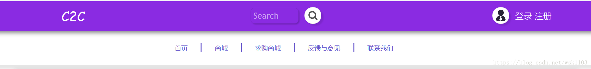

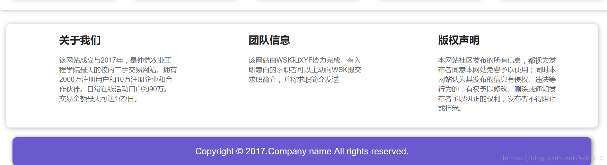

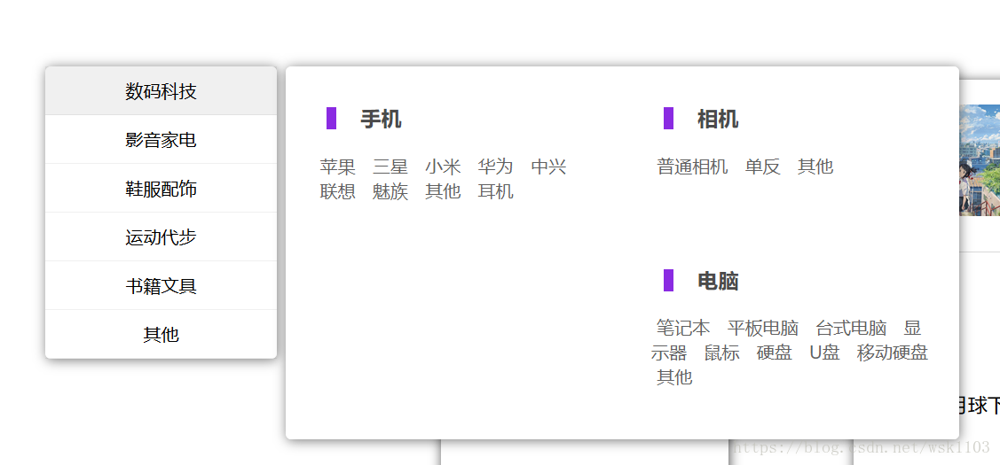

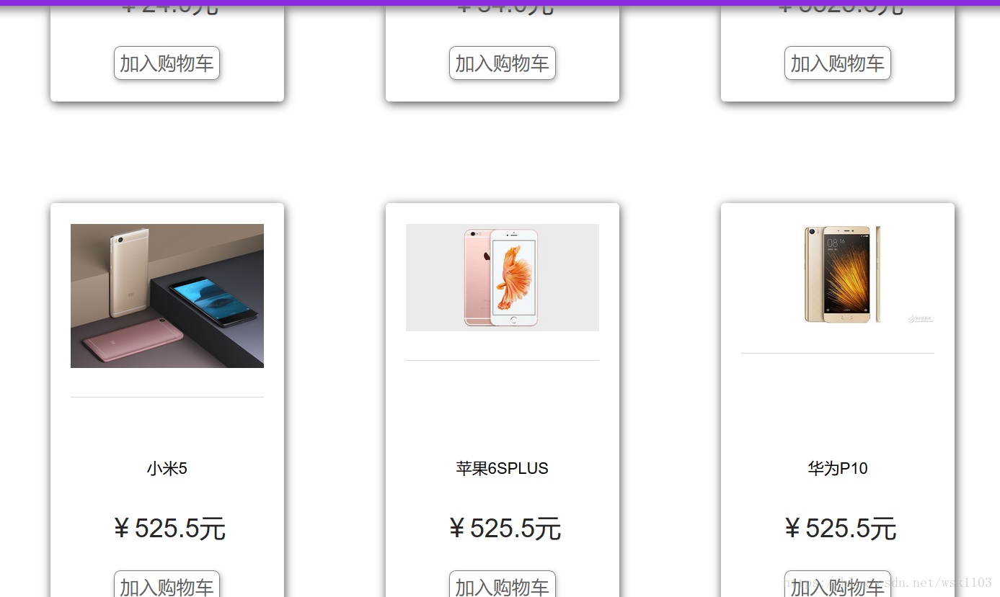

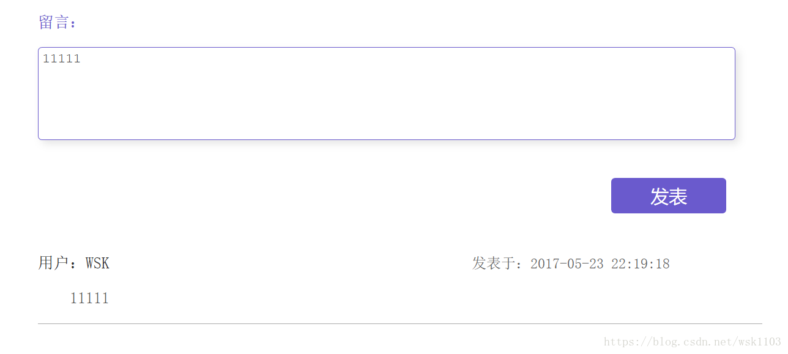

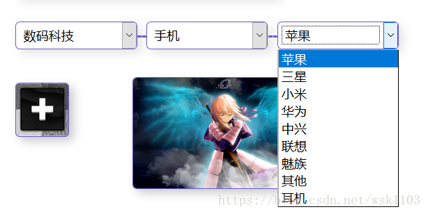

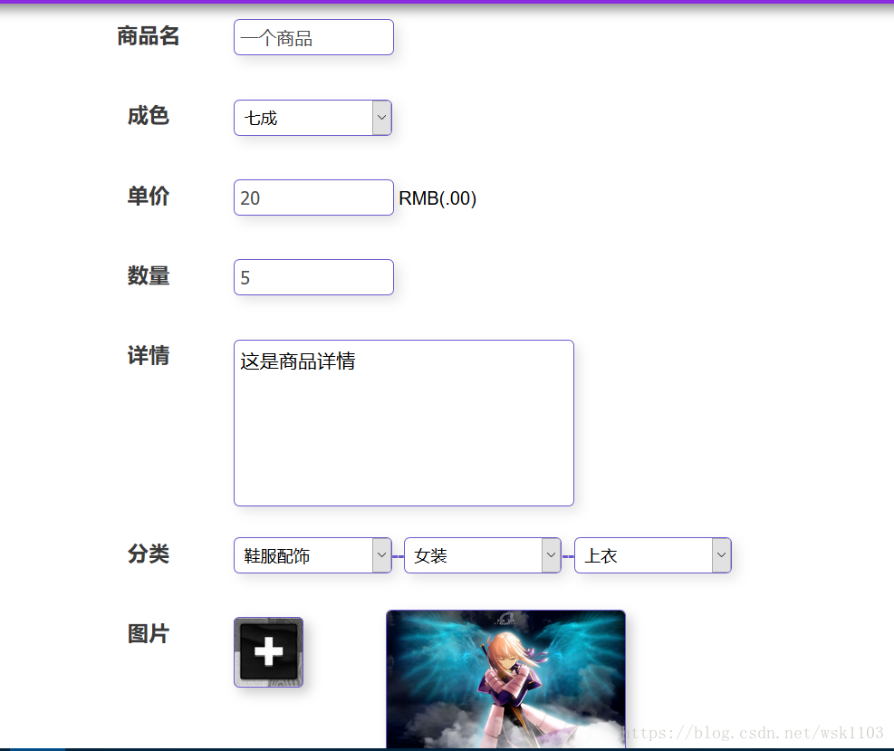

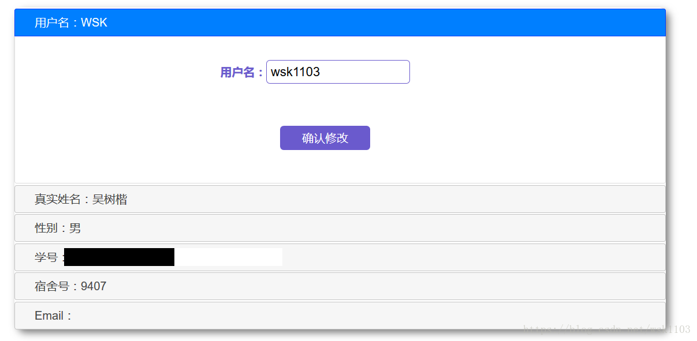

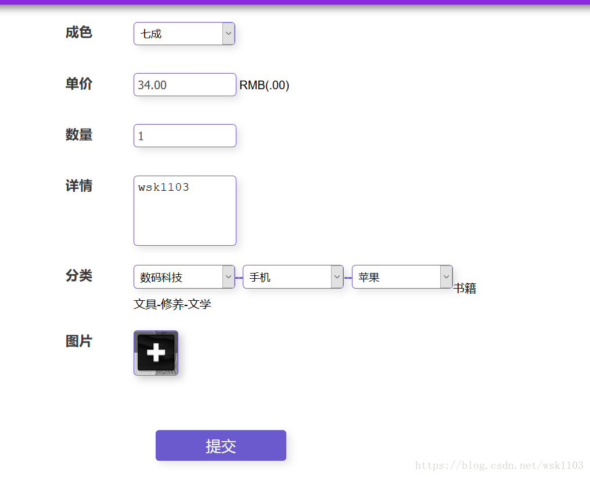

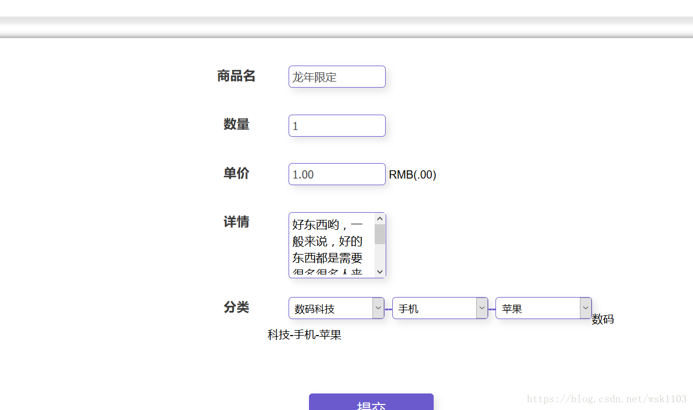

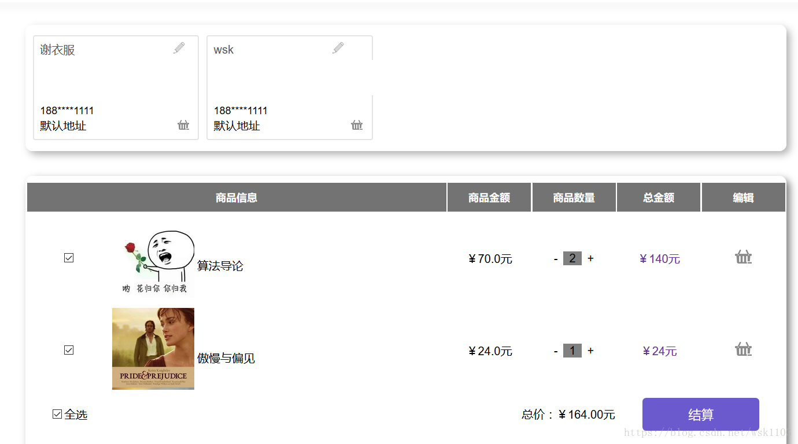

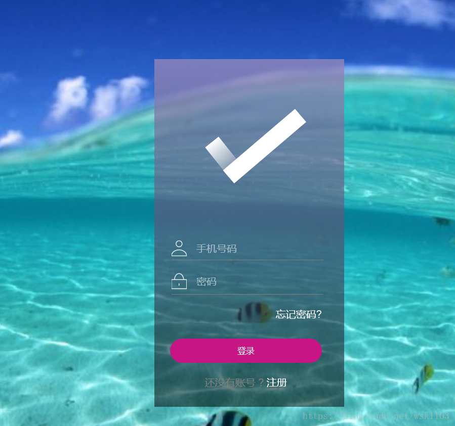

# 五、浏览地址

http://localhost:8080/    		手机号：123   密码：123456

# 六、安装教程（购买项目附赠免费部署）

1. 使用Navicat或者其它工具，在mysql中创建对应名称的数据库，执行数据库脚本
2. 使用IDEA/Eclipse导入项目，若为maven项目请选择maven;导入成功后请执行maven clean;maven install命令，然后运行；
3. 修改application.yml 里面的数据库配置
4. 启动后端项目
5. 浏览器打开浏览地址

**完整代码 + QQ: 316595344 或 WX: lz316595344 咨询**

**接毕业设计和论文**
